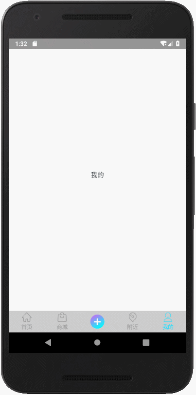

# LubinBottomTabBar

   这是一个底部导航栏小控件，上部分是小图标，下部是文字，类似微信，有点击监听、定位设置等。
   This is a bottom navigation bar small control, the upper part of the small icon,the lower part of the text, similar to WeChat, click listen, location Settings, and so on.
   
   
## 快速使用

* [](https://bintray.com/lubin/LubinBottomTabBar/LubinBottomTabBar)
[](https://bintray.com/lubin/LubinBottomTabBar/LubinBottomTabBar)


```groovy
implementation 'com.lubin.layout.tabbar:lubinbottomtabbar:0.5.1'
```
### (一)单独使用LubinBottomTabBar

#### 准备资源
 * drawable:用于图标
```xml
<selector xmlns:android="http://schemas.android.com/apk/res/android">
    <item android:drawable="@drawable/ic_shopping_basket_black_24dp" android:state_selected="true" />
    <item android:drawable="@drawable/ic_shopping_basket_wrigth_24dp" />
</selector>
``` 
 * string:底部图标下的文字 ‘name值自定义’
 ```xml
<resources>

·····
    
    <string name="bottom_bar_home">首页</string>
    <string name="bottom_bar_shoppping">商城</string>
    <string name="bottom_bar_mine">我的</string>
    <string name="bottom_bar_nearby">附近</string>
</resources>

```
 * color：文字改变颜色 ‘name值自定义’
 ```xml
 <resources>
 
 ······
 
    <color name="bottom_bar_txt_default">#999999</color>
    <color name="bottom_bar_txt_select">#00deff</color>
</resources>

```
#### xml布局中添加

```xml
    <com.lubin.layout.tabbar.LubinBottomTabBar
        android:id="@+id/tab_bar"
        android:layout_width="match_parent"
        android:layout_height="45dp" />
```
#### java（Activity或Fragment）中使用

```java
class MyActivyty{
    
    @Override
    protected void onCreate(Bundle savedInstanceState) {
        //... ...            
    
        tabItems = new ArrayList<>();
        /**
        *  TabItem 添加资源，添加一个TabItem就是底部有一个icon
        */
        tabItems.add(new TabItem(R.string.us, R.drawable.ic_01,new int[]{R.color.colorAccent,R.color.colorPrimary}, ""));
        /**
        * 获取lubinbottomtabbar后，然后赋值 
        */
        lubinbottomtabbar.initData(tabItems, this); 
        
    }
}

```

 * LubinBottomTabBar(方法调用)
 
 ```java
    /**
     * 必须最先调用
     * It has to be called first
     *
     * @param tabList  数据源
     * @param listener 事件回调
     */
    public LubinBottomTabBar initData(List<TabItem> tabList, OnTabBarListener listener)
    
    /**
     * 设置选中项
     * Set the currently selected tabBar item.
     *
     * @param item Item index to select
     */
    public LubinBottomTabBar setCurrentItem(int item)
    
    回调的监听事件
    
    /**
     * 子项点击事件监听回调
     * Item click the event callback
     *
     * @param position 选中项id
     * @param item     选中项item
     */
    void onTabClick(int position, TabItem item, View icon);

    /**
     * 选中事件回调
     * Select the event callback
     *
     * @param position 选中项id
     * @param item     选中项item
     */
    void onTabSelect(int position, TabItem item);

```
 * TabItem（子项资源赋值）
 
```java

    /**
     * 加载数据
     *
     * @param txtItem  文本资源id
     * @param icItem   图片资源id
     * @param txtSize  文字大小
     * @param txtColor 文字颜色
     * @param extra    额外信息
     */
    public TabItem(@StringRes int txtItem, @DrawableRes int icItem, @Size float txtSize, @ColorRes int[] txtColor, String extra)
    
    public TabItem(@StringRes int txtItem, @DrawableRes int icItem, String extra)

    public TabItem(@StringRes int txtItem, @DrawableRes int icItem, @ColorRes int[] txtColor, String extra)
    
    public TabItem(@StringRes int txtItem, @DrawableRes int icItem, @Size float txtSize, String extra) 

```

### (二)配合TabbarHelper使用LubinBottomTabBar
  TabbarHelper是fragment切换帮助管理工具
  
  在xml布局中添加
  ```xml
    <FrameLayout
        android:id="@+id/layout"
        android:layout_width="match_parent"
        android:layout_height="match_parent"
        android:layout_above="@id/tab_bar" />
```
  ````markdown
    //创建LubinBottomTabBar initData() 之前完成
    //R.id.layout_conter  FrameLayout布局id
    tabbarHelper = new TabbarHelper<>(this, getSupportFragmentManager(), R.id.layout_conter, this);
    
    //add 第一个参数int，从0逐加，add个数与TabItem个数要对应好；第二个参数按照规则(Fragment.clss,string类型
    tabbarHelper.add(0, new TabbarHelper.Tab<Integer>(HomeFragment.class, R.string.bottom_bar_home))
            .add(1, new TabbarHelper.Tab<Integer>(ShoppingFragment.class, R.string.bottom_bar_shoppping))
            .add(2, new TabbarHelper.Tab<Integer>(HomeFragment.class, R.string.bottom_bar_home))
            .add(3, new TabbarHelper.Tab<Integer>(HomeFragment.class, R.string.bottom_bar_home))
            .add(4, new TabbarHelper.Tab<Integer>(MineFragment.class, R.string.bottom_bar_mine));
            
            
    //在LubinBottomTabBar的监听中调用
    @Override
    public void onTabSelect(int position,TabItem item) {
        helper.performClickMenu(position);
    }

````
##### 感谢

 设计时参考了
     https://www.jianshu.com/p/60096b338dd2?utm_campaign=maleskine&utm_content=note&utm_medium=seo_notes&utm_source=recommendation文章
